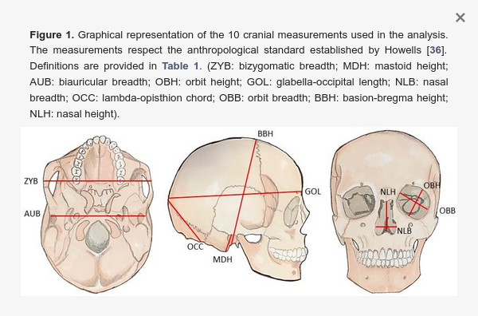

# hominid-fossil-classification

## Data Sources

### S1 Table

This table have 10 columns, for my work i will only consider the following:

- **ID**: Hominied ID
- **Species**: Hominied specie
- **Group**: Hominied group
- **GOL**: glabella-opistocranion length. 
- **XCB**: maximum biparietal cranial breadth. 
- **BBH**: basion-bregma height. 
- **BPL**: basion-prosthion length. 
- **NPH**: nasion-prosthion height. 
- **ZYB**: bizygomatic breadth. 

<figure>
  
  <figcaption>https://journals.plos.org/plosone/article?id=10.1371/journal.pone.0131055</figcaption>
</figure>

So the new dataset will be s1.csv